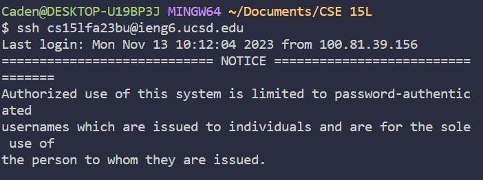
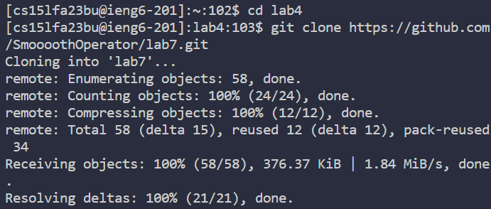
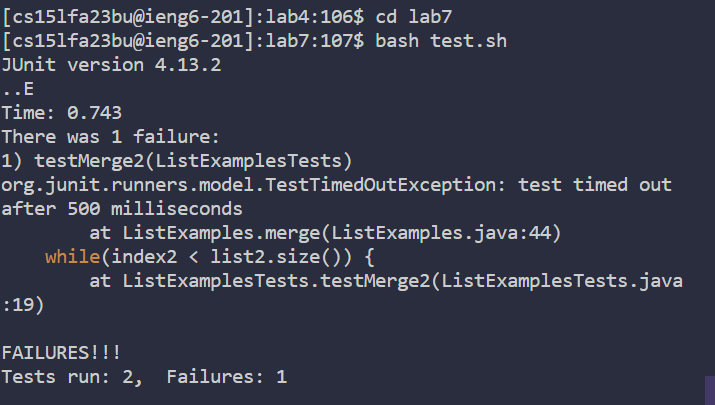
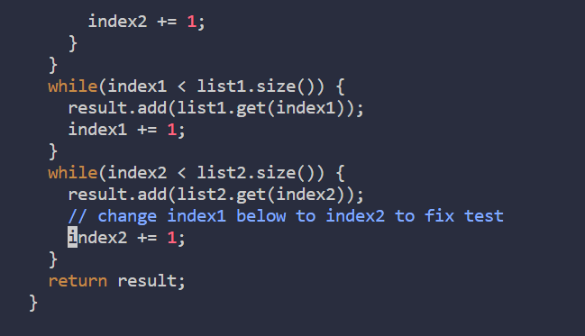
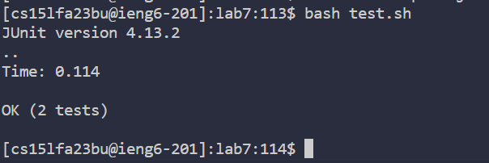
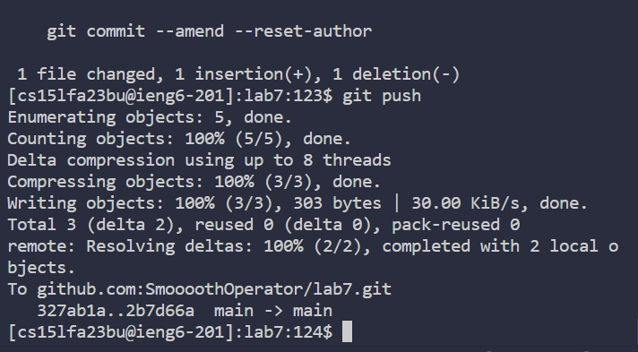

# CSE15L Lab 4

**VIM** <br>

Step 4: Log into ieng6 <br>
 <br>
Keys pressed: <br>
```
ssh<space>cs15lfa23bu@ieng6.ucsd.edu<enter> <br>
```
I used the ssh command by pressing the repective letter keys, then space, then used my account info to log into ieng6 <br>

Step 5: Clone your fork of the repository from your Github account (using the SSH URL)
 <br>
Keys pressed: <br>
```
cd<space>lab4<enter>git<space>clone<space>https://github.com/SmoooothOperator/lab7.git<enter>
```
I cd into the lab4 directory I made beforehand, then used git clone followed by the repository url to clone the directory into ieng6 <br>

Step 6: Run the tests, demonstrating that they fail <br>
 <br>
Keys pressed: <br>
```
cd<space>lab7<enter>bash<space>test.sh<enter> <br>
```
I cd into the lab7 directory just created from git clone, then I ran the test using the bash file already in the directory, the bash file includes the proper commands such as javac and java to run the tester junit file, to show that a test fails.

Step 7: Edit the code file to fix the failing test <br>
 <br>
Keys pressed: <br>
```
vim<space>ListExamples.java<enter>Gkkkkkklllllllllllxi2<esc>:w <br>
```
I used vim plus the file name i wanted to edit to edit the file from the command line. Then i used G to go to the bottom of the file, the I used a bunch of k to go up to the line where the error is in the file, the used l to go to the character the error is at. I then used x to delete and then i to insert 2 to fix the error <br>
I then quit back to normal mode useing escape and wrote the changes with :w <br>

Step 8: Run the tests, demonstrating that they now succeed <br>
 <br>
Keys pressed: <br>
```
:q<up><up><up><enter> <br>
```
I use :q, which quits vim, and then i used up arrow key to access the previously ran command bash test.sh, then pressed enter to see that the tests passed <br>

Step 9: Commit and push the resulting change to your Github account (you can pick any commit message!) <br>
 <br>
Keys pressed: <br>
```
git<space>add<space>.<enter>git<space>commit<space>-m<space>"fixed_error"<enter>git<space>push<enter> <br>
```
I used git add . to add all changes to be commited, then used git commit to commit those changes with the -m to add a message, which is "fixed error". I then used git push to push the changes <br>

